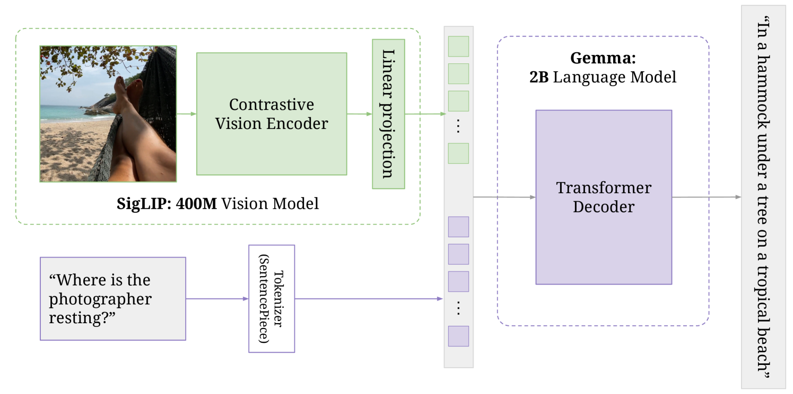

# Vision-Language Model (PaliGemma)

This repository contains a **from-scratch PyTorch implementation** of a custom Vision-Language Model inspired by Google's **PaliGemma** architecture. It integrates a **SigLIP-based vision encoder** with a **Gemma-based causal language decoder**, creating a multimodal architecture capable of processing both images and text.

---

## 🚀 Project Highlights

* **Vision Encoder**: Custom implementation of [SigLIP](https://arxiv.org/abs/2306.10883)-style transformer.
* **Language Decoder**: Custom Gemma-style causal language model with rotary embeddings and KV caching.
* **Multimodal Fusion**: Merges image embeddings as tokens in the input sequence.
* **Inference Script**: Simple interface for running inference on image-text pairs.

---

## 🏗️ Architecture Overview




---

## 📐 Architecture Breakdown

### 🔍 Vision Encoder
- Based on **SigLIP** (Contrastive Language-Image Pretraining without Labels).
- A transformer-based image encoder that produces patch-level embeddings.
- Output shape: `[batch_size, num_patches, vision_hidden_dim]`.

### 🧠 Language Decoder (Gemma-style)
- Autoregressive transformer decoder.
- Components:
  - Rotary Positional Embeddings (RoPE)
  - RMSNorm
  - Grouped Query Attention (GQA)
  - Feedforward MLP block (GEGLU activation)
  - KV Cache for efficient inference
- Output shape: `[batch_size, seq_len, hidden_dim]`

### 🔄 Multimodal Fusion
- Image patch embeddings are projected to match text hidden dimension.
- These are injected into the token stream via special `<image>` tokens.
- Final embedding sequence combines text and image embeddings using attention masks.

---

## 🖼️ Preprocessing Pipeline (Processor)

### Responsibilities:
- Tokenize the input text prompt
- Resize and normalize the input image
- Replace `<image>` placeholder tokens with actual image features

### Steps:
1. **Image Processing**
   - Resize image to `image_size x image_size`
   - Normalize using vision model's mean/std
2. **Text Processing**
   - Tokenize with tokenizer
   - Inject special image token (`<image>` or `image_token_index`)
3. **Fusion**
   - Merge image tokens with text embeddings
   - Generate correct attention mask and position ids

---

## 📤 Inference Flow

### Entry: `test_inference()`
- Accepts: prompt, image path, tokenizer, model, and generation config
- Flow:
  1. Preprocess input via `PaliGemmaProcessor`
  2. Generate image + text embeddings
  3. Inject into `GemmaForCausalLM`
  4. Autoregressively generate tokens using top-p or greedy decoding

### Caching:
- Uses `KVCache` to store key/value states per layer.
- Only the new token is passed at each step (via `q_len = 1`).
- Greatly improves inference speed.

---

## 📁 File Structure

```txt
├── model_gemma.py               # Core model components: Gemma decoder, attention, MLP
├── processing_paligemma.py     # Processor: image + text token prep
├── test_inference.py           # Inference runner with Fire CLI
├── utils.py                    # HF model loader or helper functions
├── launch_inference.sh         # Shell script for CLI testing
├── vlm_paligemma_model.png     # Architecture diagram

```

---

## 📦 Dependencies

* Python 3.10+
* PyTorch
* torchvision
* transformers
* fire
* PIL

Install dependencies:

```bash
pip install torch torchvision transformers fire pillow
```

---


## 🧠 & 📚 Inspiration & References

This project is heavily inspired by Google DeepMind's **PaliGemma** Vision-Language architecture:

* 🔗 [Google Blog – PaliGemma Explained](https://developers.googleblog.com/en/gemma-explained-paligemma-architecture/)
* 📄 [Official Paper (arXiv:2407.07726)](https://arxiv.org/abs/2407.07726)

> This is a **research and learning project**. The implementation is completely custom and does not use pre-trained models.


---

## 📜 License

This project is currently unlicensed. Feel free to fork and experiment for educational purposes. Contact the author if you plan to use this commercially.

---

## 🔖 Author

**Dhruv Panchal**
[GitHub](https://github.com/panchaldhruv27223)

Feel free to star ⭐ this repo if you find it useful!
